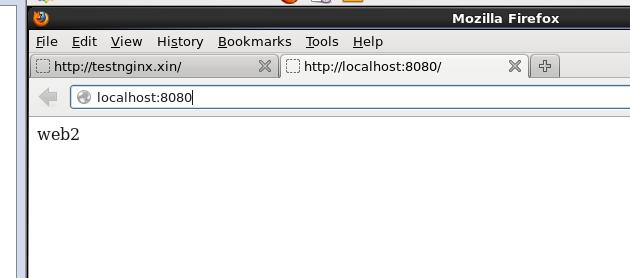
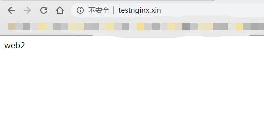

# Nginx可以做什么

本文只针对Nginx在不加载第三方模块的情况能处理哪些事情，由于第三方模块太多所以也介绍不完，当然本文本身也可能介绍的不完整，毕竟只是我个人使用过和了解到过得，欢迎留言交流。

## **Nginx能做什么**

* 反向代理
* 负载均衡
* HTTP服务器（动静分离）
* 正向代理

以上就是我了解到的Nginx在不依赖第三方模块能处理的事情，下面详细说明每种功能怎么做。

## 测试环境

1.本机有VMware软件，有一个虚拟机，系统为CentOS，桥接方式联网，使用lnmp一件安装包搭建服务器环境。

2.在`/usr/local/nginx/conf/vhost` 添加`testnginx.conf`配置文件，内容为：

```
server
{
    listen       80;
    server_name  testnginx.xin;
    client_max_body_size 1024M;
    location / {
		root   /data/httpd/web1/;
		index  index.html index.htm index.php;
    }
}
```

重启nginx。

3.创建`/data/httpd/`目录，再此目录下分别创建`web1`和`web2`目录，然后在`web1`目录下添加`index.html`文件输入`web1`，在`web2`目录下添加`index.php`文件输入`<?php echo 'web2';?>`

4.`80`端口是对外开放的，`8080`端口不对外开放，在目录`/data/httpd/web2/` 目标下运行命令`php -S localhost:8080` 利用php自带扩展简单生成一个8080端口服务器。 这样虚拟机中有两个服务器`80`和`8080`。




## **1、反向代理**

**反向代理**应该是Nginx做的最多的一件事了，什么是反向代理呢，以下是百度百科的说法：反向代理（Reverse Proxy）方式是指以代理服务器来接受internet上的连接请求，然后将请求转发给内部网络上的服务器，并将从服务器上得到的结果返回给internet上请求连接的客户端，此时代理服务器对外就表现为一个反向代理服务器。简单来说就是真实的服务器不能直接被外部网络访问，所以需要一台代理服务器，而代理服务器能被外部网络访问的同时又跟真实服务器在同一个网络环境，当然也可能是同一台服务器，端口不同而已。下面贴上一段简单的实现反向代理的代码

```
server {
	listen       80;
	server_name  testnginx.xin;
	client_max_body_size 1024M;
	location / {
		proxy_pass http://localhost:8080;
		proxy_set_header Host $host:$server_port;
	}
}
```

保存配置文件后启动Nginx，这样当我们访问`http://testnginx.xin`的时候，就相当于访问localhost:8080了



## **2、负载均衡**

负载均衡也是Nginx常用的一个功能，负载均衡其意思就是分摊到多个操作单元上进行执行，例如Web服务器、FTP服务器、企业关键应用服务器和其它关键任务服务器等，从而共同完成工作任务。简单而言就是当有2台或以上服务器时，根据规则随机的将请求分发到指定的服务器上处理，负载均衡配置一般都需要同时配置反向代理，通过反向代理跳转到负载均衡。而Nginx目前支持自带3种负载均衡策略，还有2种常用的第三方策略。

### **1.RR（默认）**

每个请求按时间顺序逐一分配到不同的后端服务器，如果后端服务器down掉，能自动剔除。

简单配置

```
upstream backend {
    server localhost:8080;
    server localhost:8081;
    server localhost:8082;
}
server {
	listen       80;                                                         
	server_name  localhost;                                               
	client_max_body_size 1024M;
	location / {
		proxy_pass http://backend;
		proxy_set_header Host $host:$server_port;
	}
}
```

负载均衡的核心代码为

```
upstream backend {
    server localhost:8080;
    server localhost:8081;
    server localhost:8082;
}
```

这里我配置了3台服务器，当然实际上是一台，只是端口不一样而已，端口`8081`仿照端口`8080`做个一展示`web3`的服务器，而8082的服务器是不存在的,也就是说访问不到，但是我们访问`http://testnginx.xin` 的时候,也不会有问题，会默认跳转到`http://localhost:8080`或`http://localhost:8081` 具体是因为Nginx会自动判断服务器的状态，如果服务器处于不能访问（服务器挂了），就不会跳转到这台服务器，所以也避免了一台服务器挂了影响使用的情况，由于Nginx默认是RR策略，所以我们不需要其他更多的设置。

### **2.权重**

指定轮询几率，weight和访问比率成正比，用于后端服务器性能不均的情况。例如

```
upstream backend {
	server localhost:8080 weight=9;
	server localhost:8081 weight=1;
}
```

 那么10次一般只会有1次会访问到8081，而有9次会访问到8080

### **3.ip\_hash**

上面的2种方式都有一个问题，那就是下一个请求来的时候请求可能分发到另外一个服务器，当我们的程序不是无状态的时候（采用了session保存数据），这时候就有一个很大的很问题了，比如把登录信息保存到了session中，那么跳转到另外一台服务器的时候就需要重新登录了，所以很多时候我们需要一个客户只访问一个服务器，那么就需要用iphash了，iphash的每个请求按访问ip的hash结果分配，这样每个访客固定访问一个后端服务器，可以解决session的问题。

```
upstream backend {
	ip_hash;
	server localhost:8080;
	server localhost:8081;
}
```

### **4.fair（第三方）**

按后端服务器的响应时间来分配请求，响应时间短的优先分配。

```
upstream backend { 
	fair; 
	server localhost:8080;
	server localhost:8081;
}
```

### **5.url\_hash（第三方）**

按访问url的hash结果来分配请求，使每个url定向到同一个后端服务器，后端服务器为缓存时比较有效。 在upstream中加入hash语句，server语句中不能写入weight等其他的参数，hash\_method是使用的hash算法

```text
upstream backend { 
    hash $request_uri; 
    hash_method crc32; 
    server localhost:8080;
    server localhost:8081;
} 
```

以上5种负载均衡各自适用不同情况下使用，所以可以根据实际情况选择使用哪种策略模式,不过fair和url\_hash需要安装第三方模块才能使用，由于本文主要介绍Nginx能做的事情，所以Nginx安装第三方模块不会再本文介绍

## **3、HTTP服务器**

Nginx本身也是一个静态资源的服务器，当只有静态资源的时候，就可以使用Nginx来做服务器，同时现在也很流行动静分离，就可以通过Nginx来实现，首先看看Nginx做静态资源服务器

```text
server {
    listen       80;                                                         
    server_name  localhost;                                               
    client_max_body_size 1024M;
    location / {
           root   e:wwwroot;
           index  index.html;
    }
}
```

这样如果访问http://localhost 就会默认访问到E盘wwwroot目录下面的index.html，如果一个网站只是静态页面的话，那么就可以通过这种方式来实现部署。

动静分离动静分离是让动态网站里的动态网页根据一定规则把不变的资源和经常变的资源区分开来，动静资源做好了拆分以后，我们就可以根据静态资源的特点将其做缓存操作，这就是网站静态化处理的核心思路

```text
upstream test{  
   server localhost:8080;  
   server localhost:8081;  
}   
server {  
    listen       80;  
    server_name  localhost;  
    location / {  
        root   e:wwwroot;  
        index  index.html;  
    }  
    
	# 所有静态请求都由nginx处理，存放目录为html  
    location ~ .(gif|jpg|jpeg|png|bmp|swf|css|js)$ {  
        root    e:wwwroot;  
    }  
        
	# 所有动态请求都转发给tomcat处理  
    location ~ .(jsp|do)$ {  
        proxy_pass  http://test;  
    }  
    error_page   500 502 503 504  /50x.html;  
    location = /50x.html {  
        root   e:wwwroot;  
    }  
}  
```

这样我们就可以吧HTML以及图片和css以及js放到wwwroot目录下，而tomcat只负责处理jsp和请求，例如当我们后缀为gif的时候，Nginx默认会从wwwroot获取到当前请求的动态图文件返回，当然这里的静态文件跟Nginx是同一台服务器，我们也可以在另外一台服务器，然后通过反向代理和负载均衡配置过去就好了，只要搞清楚了最基本的流程，很多配置就很简单了，另外localtion后面其实是一个正则表达式，所以非常灵活

## **4、正向代理**

**正向代理**，意思是一个位于客户端和原始服务器\(origin server\)之间的服务器，为了从原始服务器取得内容，客户端向代理发送一个请求并指定目标\(原始服务器\)，然后代理向原始服务器转交请求并将获得的内容返回给客户端。客户端才能使用正向代理。当你需要把你的服务器作为代理服务器的时候，可以用Nginx来实现正向代理，但是目前Nginx有一个问题，那么就是不支持HTTPS，虽然我百度到过配置HTTPS的正向代理，但是到最后发现还是代理不了，当然可能是我配置的不对，所以也希望有知道正确方法的同志们留言说明一下。

```text
resolver 114.114.114.114 8.8.8.8;
server {
	resolver_timeout 5s;
    listen 81;
    access_log  e:wwwrootproxy.access.log;
    error_log   e:wwwrootproxy.error.log;
    location / {
        proxy_pass http://$host$request_uri;
    }
}
```

resolver是配置正向代理的DNS服务器，listen 是正向代理的端口，配置好了就可以在ie上面或者其他代理插件上面使用服务器ip+端口号进行代理了。

